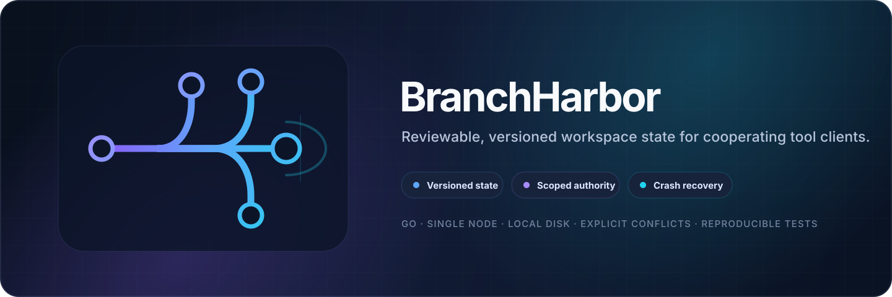
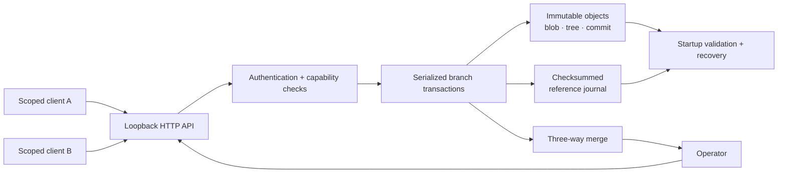

<p align="center">
  
</p>

<p align="center">
  <a href="https://github.com/C-X1an/branchharbor/actions/workflows/verify.yml"></a>
  
  
  
  <a href="./LICENSE"></a>
</p>

<p align="center">
  <a href="#why-branchharbor">Why BranchHarbor</a> ·
  <a href="#quickstart">Quickstart</a> ·
  <a href="#architecture">Architecture</a> ·
  <a href="#verification">Verification</a> ·
  <a href="#security-boundary">Security</a> ·
  <a href="./API.md">API</a>
</p>

---

BranchHarbor is an **experimental single-node versioned workspace store** for cooperating tool clients. Clients propose bounded file changes on isolated branches; an operator reviews and promotes changes through explicit whole-file three-way merges.

The system is intentionally narrow. It focuses on **immutable content-addressed state, optimistic concurrency, durable retry identity, scoped authority, ordered publication, explicit conflicts, and crash recovery**. It does **not** execute stored files or call an AI model.

> [!IMPORTANT]
> BranchHarbor is a systems project, not a replacement for Git and not a production-availability claim. The supported boundary is a trusted operator, one owning process, and a Linux local filesystem with file and directory `fsync` support.

## Why BranchHarbor

<table>
<tr>
<td width="33%" valign="top">
<h3>Bounded authority</h3>
Clients receive branch, path-prefix, and operation scopes. Ordinary clients cannot promote, restore, fork, or enumerate all branches.
</td>
<td width="33%" valign="top">
<h3>Reviewable state</h3>
Immutable content-addressed objects preserve snapshots while expected-head checks make stale writes and competing changes explicit.
</td>
<td width="33%" valign="top">
<h3>Failure semantics</h3>
Durable request identity supports safe retries after lost responses, while uncertain journal I/O stops mutation until restart.
</td>
</tr>
</table>

### At a glance

| Property | Design |
|---|---|
| **Runtime** | Go 1.27.1 on Linux |
| **Topology** | Single process, single store owner, multiple authenticated HTTP clients |
| **State** | Immutable blobs / trees / commits with mutable branch references |
| **Concurrency** | Expected commit + version checks; serialized mutation path |
| **Authorization** | HMAC-authenticated capabilities scoped by branch, path prefix, and operation |
| **Merge behavior** | Whole-file three-way merge; conflicts refuse promotion |
| **Recovery** | Checksummed reference journal + startup integrity checks |
| **Dependencies** | Runtime and Python demo use standard libraries |

## Quickstart

Use Linux, or WSL2 with the repository stored inside its Linux filesystem. Install **Go 1.27.1**, Python 3.11+, Make, Git, and a C compiler for the race detector.

```bash
git clone https://github.com/C-X1an/branchharbor.git
cd branchharbor

make build
make demo
```

The demo starts a real temporary loopback service and drives it with two scoped clients. It exercises:

- branch isolation and permission denials;
- disjoint changes that merge cleanly;
- stale-write rejection;
- conflicting merge refusal;
- durable retry identity across restart.

It requires **no credentials, cloud account, paid service, or model API** and removes its temporary store afterward.

<details>
<summary><strong>Run a persistent local store</strong></summary>

```bash
./bin/branchharbor init --dir .bh

./bin/branchharbor token \
  --dir .bh \
  --subject operator \
  --branch '*' \
  --ops admin \
  --ttl 900 \
  --out operator.token

./bin/branchharbor serve \
  --dir .bh \
  --listen 127.0.0.1:8787
```

The token command writes a new owner-only file and does not print its value. Operator tokens have full store authority. Issue narrow branch and directory-prefix tokens with `--ops read,write` for ordinary clients.

See the [HTTP API](./API.md) and [standard-library client example](./examples/agent_client.py).

</details>

## Architecture



### Mutation publication order

A successful mutation:

1. writes immutable object files;
2. synchronizes object files and their directory entries;
3. appends and synchronizes the journal reference;
4. publishes the new branch head in memory;
5. only then acknowledges success.

Expected commit **and** version are checked together. If a response is lost after a committed write, retry the identical request ID and payload. Changed contents under the same retry identity are rejected.

## API surface

BranchHarbor exposes a deliberately small JSON-over-HTTP surface.

| Capability | Representative route |
|---|---|
| Health | `GET /healthz` |
| Branch head | `GET /v1/head?branch=...` |
| List scoped files | `GET /v1/files?branch=...` |
| Read file | `GET /v1/file?branch=...&path=...` |
| Commit changes | `POST /v1/commit` |
| Fork branch | `POST /v1/fork` |
| Preview / perform merge | `POST /v1/merge/preview`, `POST /v1/merge` |
| Restore reachable snapshot | `POST /v1/restore` |
| Aggregate metrics | `GET /metrics` |

Authentication, request formats, limits, errors, idempotency rules, and examples are documented in **[API.md](./API.md)**.

## Verification

```bash
make verify
make fuzz
```

`make verify` checks the pinned toolchain, formatting, build, `go vet`, tests, race detection, and the real HTTP demo.

`make fuzz` runs five bounded campaigns covering:

- logical paths;
- journal frames;
- tree merging;
- strict JSON parsing;
- capability tokens.

Useful focused commands:

```bash
make test
make integration
make acceptance
make security
make race
```

The public GitHub Actions workflow runs verification and all five bounded fuzz campaigns on pull requests and pushes to `main`.

## Security boundary

BranchHarbor treats network clients and stored file contents as untrusted, but **trusts the local OS, filesystem owner, and service process**.

> [!WARNING]
> Keep the service bound to loopback. It does not provide TLS. For remote access, use a trusted SSH tunnel rather than exposing the service directly.

Tokens are local HMAC-authenticated capabilities rather than OAuth/JWT credentials. Bearer theft grants the remaining token authority; token lifetimes are capped at one hour and immediate per-token revocation is not implemented.

Read **[SECURITY.md](./SECURITY.md)** before storing anything sensitive.

## Operational notes

- One process owns a store at a time.
- Back up only after stopping the server.
- Preserve the entire store directory, including `FORMAT`, journal, objects, and `auth.key`.
- Unsupported formats are refused; there is no automatic migration.
- History retention and orphan garbage collection are **not** secure secret erasure.
- Detectable complete corruption causes startup refusal rather than silent repair.

## Deliberate limitations

BranchHarbor does **not** currently claim:

- native Windows or macOS support;
- network-filesystem support;
- multi-node replication or consensus;
- public-Internet hardening;
- TLS termination;
- at-rest encryption;
- secure historical erasure;
- semantic validation of proposed content;
- physical power-loss certification;
- production availability or capacity.

Format 1 also has documented partial-frame and coherent-history-rewrite limitations. See [SECURITY.md](./SECURITY.md) for the security framing.

## Repository map

```text
branchharbor/
├── cmd/branchharbor/       CLI entry point
├── internal/
│   ├── api/                HTTP boundary and admission
│   ├── auth/               capability tokens and scope checks
│   ├── store/              objects, journal, commits, recovery
│   └── strictjson/         bounded strict JSON parsing
├── tests/                  locked acceptance tests
├── examples/               standard-library client adapter
├── scripts/                deterministic demo tooling
├── .github/workflows/      public verification workflow
├── API.md                  HTTP contract
├── SECURITY.md             trust boundary and disclosure policy
└── README.md               reviewer-facing overview
```

## Contributing

Contributions are welcome when they preserve the project’s explicit failure and authority semantics. Start with **[CONTRIBUTING.md](./CONTRIBUTING.md)** and include tests for behavioral changes.

Security-sensitive reports should follow **[SECURITY.md](./SECURITY.md)** rather than public issues.

## License

Original code and documentation are available under the **[MIT License](./LICENSE)**.

---

<p align="center">
  <sub>Make state changes inspectable. Make authority explicit. Make failure behavior testable.</sub>
</p>
